PCAtools: everything Principal Component Analysis
================
Kevin Blighe, Aaron Lun
2020-02-15

-   [Introduction](#introduction)
-   [Installation](#installation)
    -   [1. Download the package from Bioconductor](#download-the-package-from-bioconductor)
    -   [2. Load the package into R session](#load-the-package-into-r-session)
-   [Quick start](#quick-start)
    -   [A scree plot](#a-scree-plot)
    -   [A bi-plot](#a-bi-plot)
    -   [A pairs plot](#a-pairs-plot)
    -   [A loadings plot](#a-loadings-plot)
    -   [An eigencor plot](#an-eigencor-plot)
-   [Advanced features](#advanced-features)
    -   [Determine optimum number of PCs to retain](#determine-optimum-number-of-pcs-to-retain)
    -   [Modify bi-plots](#modify-bi-plots)
        -   [Colour by a factor from the metadata, use a custom label, add lines through center, and add legend](#colour-by-a-factor-from-the-metadata-use-a-custom-label-add-lines-through-center-and-add-legend)
        -   [Supply custom colours, add more lines, and increase legend size](#supply-custom-colours-add-more-lines-and-increase-legend-size)
        -   [Change shape based on tumour grade, remove connectors, and add titles](#change-shape-based-on-tumour-grade-remove-connectors-and-add-titles)
        -   [Remove labels, modify line types, remove gridlines, and increase point size](#remove-labels-modify-line-types-remove-gridlines-and-increase-point-size)
        -   [Colour by a continuous variable (colour controlled by ggplot2 engine); plot other PCs](#colour-by-a-continuous-variable-colour-controlled-by-ggplot2-engine-plot-other-pcs)
    -   [Quickly explore potentially informative PCs via a pairs plot](#quickly-explore-potentially-informative-pcs-via-a-pairs-plot)
    -   [Determine the variables that drive variation among each PC](#determine-the-variables-that-drive-variation-among-each-pc)
    -   [Correlate the principal components back to the clinical data](#correlate-the-principal-components-back-to-the-clinical-data)
    -   [Plot the entire project on a single panel](#plot-the-entire-project-on-a-single-panel)
-   [Acknowledgments](#acknowledgments)
-   [Session info](#session-info)
-   [References](#references)

Introduction
============

Principal Component Analysis (PCA) is a very powerful technique that has wide applicability in data science, bioinformatics, and further afield. It was initially developed to analyse large volumes of data in order to tease out the differences/relationships between the logical entities being analysed. It extracts the fundamental structure of the data without the need to build any model to represent it. This 'summary' of the data is arrived at through a process of reduction that can transform the large number of variables into a lesser number that are uncorrelated (i.e. the ‘principal components'), while at the same time being capable of easy interpretation on the original data (Blighe and Lun 2019) (Blighe 2013).

*PCAtools* provides functions for data exploration via PCA, and allows the user to generate publication-ready figures. PCA is performed via *BiocSingular* (Lun 2019) - users can also identify optimal number of principal components via different metrics, such as elbow method and Horn's parallel analysis (Horn 1965) (Buja and Eyuboglu 1992), which has relevance for data reduction in single-cell RNA-seq (scRNA-seq) and high dimensional mass cytometry data.

Installation
============

1. Download the package from Bioconductor
-----------------------------------------

``` r
    if (!requireNamespace('BiocManager', quietly = TRUE))
        install.packages('BiocManager')

    BiocManager::install('PCAtools')
```

Note: to install development version:

``` r
    devtools::install_github('kevinblighe/PCAtools')
```

2. Load the package into R session
----------------------------------

``` r
    library(PCAtools)
```

Quick start
===========

For this vignette, we will load breast cancer gene expression data with recurrence free survival (RFS) from [Gene Expression Profiling in Breast Cancer: Understanding the Molecular Basis of Histologic Grade To Improve Prognosis](https://www.ncbi.nlm.nih.gov/geo/query/acc.cgi?acc=GSE2990).

First, let's read in and prepare the data:

``` r
  library(Biobase)
  library(GEOquery)

  # load series and platform data from GEO
  gset <- getGEO('GSE2990', GSEMatrix = TRUE, getGPL = FALSE)

  x <- exprs(gset[[1]])

  # remove Affymetrix control probes
  x <- x[-grep('^AFFX', rownames(x)),]

  # extract information of interest from the phenotype data (pdata)
  idx <- which(colnames(pData(gset[[1]])) %in%
    c('age:ch1', 'distant rfs:ch1', 'er:ch1',
      'ggi:ch1', 'grade:ch1', 'size:ch1',
      'time rfs:ch1'))

  metadata <- data.frame(pData(gset[[1]])[,idx],
    row.names = rownames(pData(gset[[1]])))

  # tidy column names
  colnames(metadata) <- c('Age', 'Distant.RFS', 'ER', 'GGI', 'Grade',
    'Size', 'Time.RFS')

  # prepare certain phenotypes
  metadata$Age <- as.numeric(gsub('^KJ', NA, metadata$Age))
  metadata$Distant.RFS <- factor(metadata$Distant.RFS, levels=c(0,1))
  metadata$ER <- factor(gsub('\\?', NA, metadata$ER), levels=c(0,1))
  metadata$ER <- factor(ifelse(metadata$ER == 1, 'ER+', 'ER-'), levels = c('ER-', 'ER+'))
  metadata$GGI <- as.numeric(metadata$GGI)
  metadata$Grade <- factor(gsub('\\?', NA, metadata$Grade), levels=c(1,2,3))
  metadata$Grade <- gsub(1, 'Grade 1', gsub(2, 'Grade 2', gsub(3, 'Grade 3', metadata$Grade)))
  metadata$Grade <- factor(metadata$Grade, levels = c('Grade 1', 'Grade 2', 'Grade 3'))
  metadata$Size <- as.numeric(metadata$Size)
  metadata$Time.RFS <- as.numeric(gsub('^KJX|^KJ', NA, metadata$Time.RFS))

  # remove samples from the pdata that have any NA value
  discard <- apply(metadata, 1, function(x) any(is.na(x)))

  metadata <- metadata[!discard,]

  # filter the expression data to match the samples in our pdata
  x <- x[,which(colnames(x) %in% rownames(metadata))]

  # check that sample names match exactly between pdata and expression data 
  all(colnames(x) == rownames(metadata))
```

    ## [1] TRUE

Conduct principal component analysis (PCA)

``` r
  p <- pca(x, metadata = metadata, removeVar = 0.1)
```

    ## -- removing the lower 10% of variables based on variance

A scree plot
------------

``` r
  screeplot(p)
```

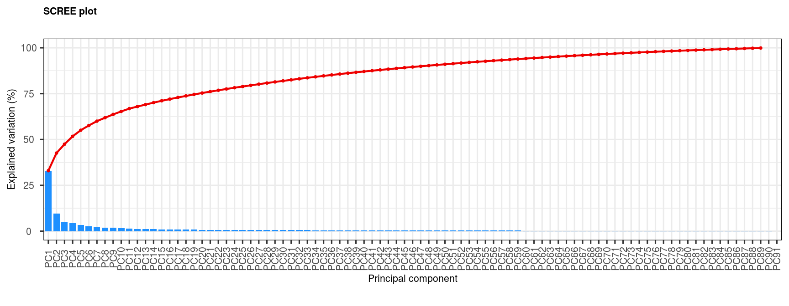

A bi-plot
---------

``` r
  biplot(p)
```

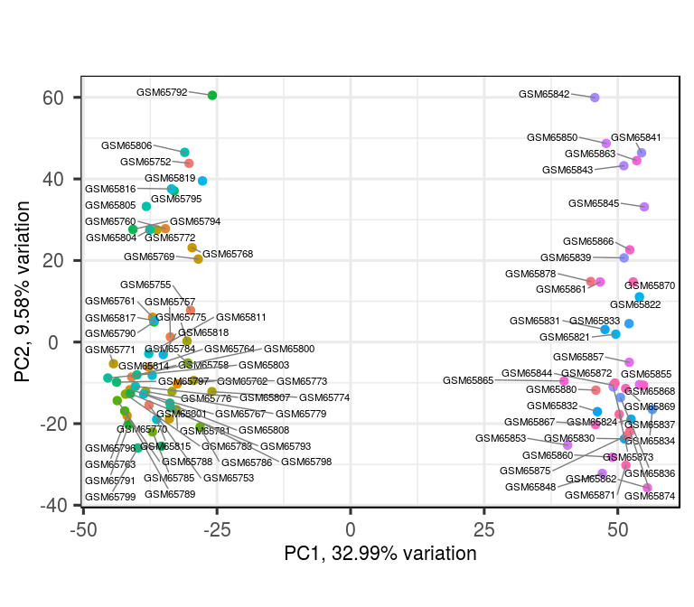

A pairs plot
------------

``` r
  pairsplot(p)
```

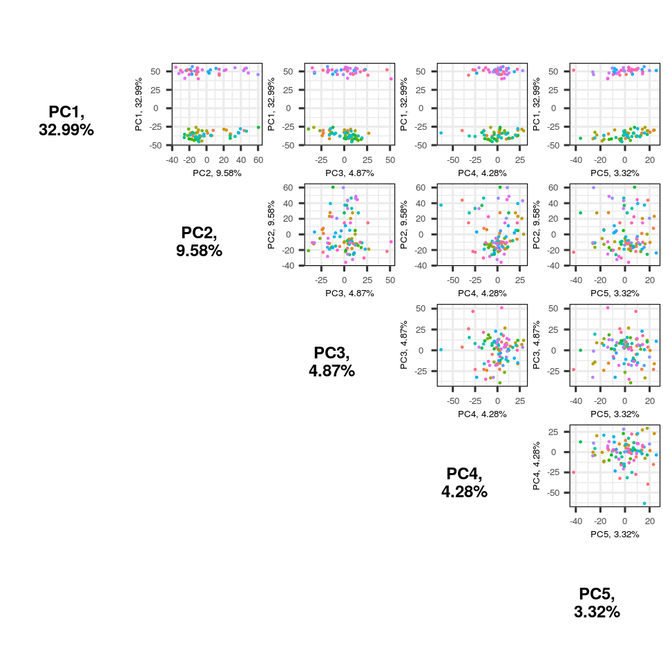

A loadings plot
---------------

``` r
  plotloadings(p)
```

    ## -- variables retained:

    ## 215281_x_at, 214464_at, 211122_s_at, 210163_at, 204533_at, 205225_at, 209351_at, 205044_at, 202037_s_at, 204540_at, 215176_x_at, 214768_x_at, 212671_s_at, 219415_at, 37892_at, 208650_s_at, 206754_s_at, 205358_at, 205380_at, 205825_at


An eigencor plot
----------------

``` r
  eigencorplot(p,
    metavars = c('Age','Distant.RFS','ER','GGI','Grade','Size','Time.RFS'))
```

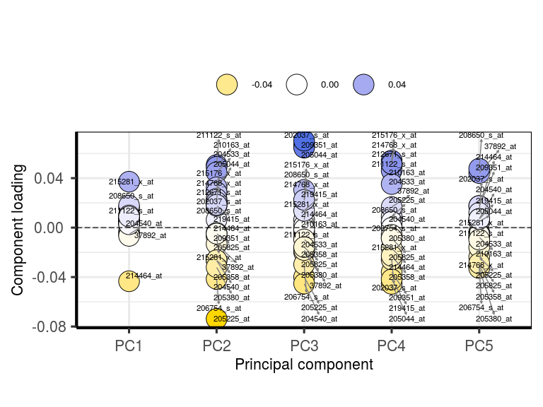

Advanced features
=================

All plots in PCAtools are highly configurable and should cover virtually all general usage requirements. The following sections take a look at some of these advanced features, and form a somewhat practical example of how one can use PCAtools to make a clinical interpretation of data.

Determine optimum number of PCs to retain
-----------------------------------------

A scree plot on its own just shows the accumulative proportion of explained variation, but how can we determine the optimum number of PCs to retain? *PCAtools* provides two metrics for this purpose: elbow method and Horn's parallel analysis (Horn 1965) (Buja and Eyuboglu 1992).

Let's perform Horn's parallel analysis first:

``` r
  horn <- parallelPCA(x)
  horn$n
```

    ## [1] 11

Now the elbow method:

``` r
  elbow <- findElbowPoint(p$variance)
  elbow
```

    ## PC8 
    ##   8

In most cases, the identified values will disagree. This is because finding the correct number of PCs is a difficult task and is akin to finding the 'correct' number of clusters in a dataset - there is no correct answer.

Taking the value from Horn's parallel analyis, we can produce a new scree plot:

``` r
  library(ggplot2)

  screeplot(p,
    components = getComponents(p, 1:20),
    vline = c(horn$n, elbow)) +
    geom_text(aes(horn$n + 1, 50, label = "Horn's", vjust = -1)) +
    geom_text(aes(elbow + 1, 50, label = "Elbow", vjust = -1))
```

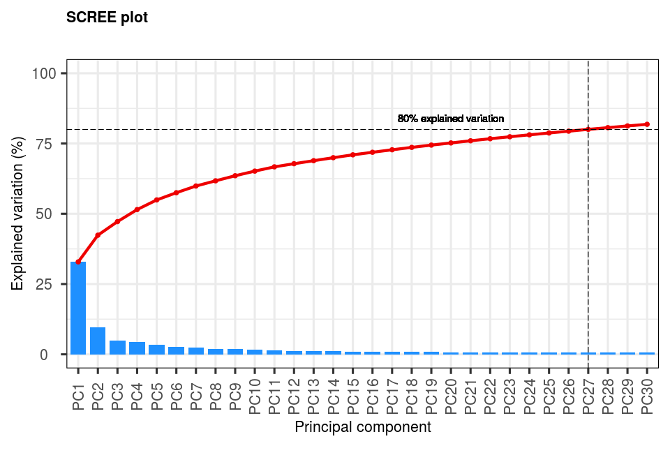

If all else fails, one can simply take the number of PCs that contributes to a pre-selected total of explained variation, e.g., in this case, 27 PCs account for &gt;80% explained variation.

Modify bi-plots
---------------

The bi-plot comparing PC1 versus PC2 is the most characteristic plot of PCA. However, PCA is much more than the bi-plot and much more than PC1 and PC2. This said, PC1 and PC2, by the very nature of PCA, are indeed usually the most important parts of PCA.

In a bi-plot, we can shade the points by different groups and add many more features.

### Colour by a factor from the metadata, use a custom label, add lines through center, and add legend

``` r
  biplot(p,
    lab = paste0(p$metadata$Age, 'yo'),
    colby = 'ER',
    hline = 0, vline = 0,
    legendPosition = 'right')
```

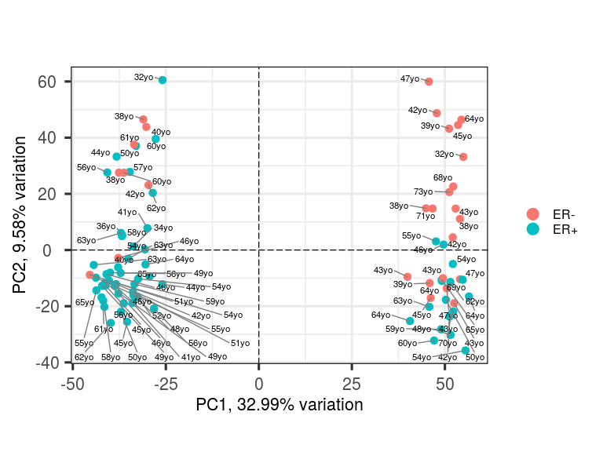

### Supply custom colours, add more lines, and increase legend size

``` r
  biplot(p,
    colby = 'ER', colkey = c('ER+'='forestgreen', 'ER-'='purple'),
    hline = 0, vline = c(-25, 0, 25),
    legendPosition = 'top', legendLabSize = 16, legendIconSize = 8.0)
```

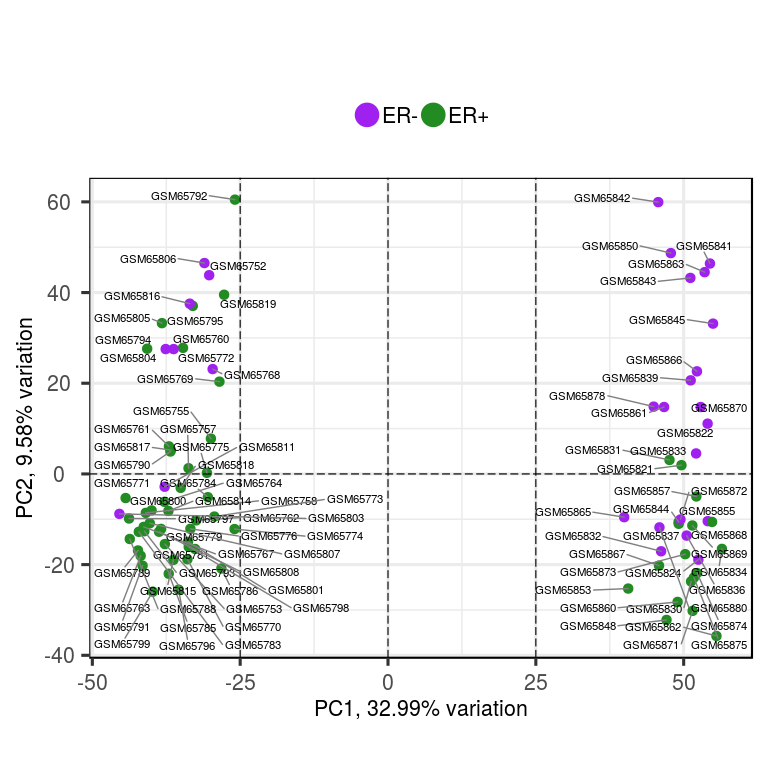

### Change shape based on tumour grade, remove connectors, and add titles

``` r
  biplot(p,
    colby = 'ER', colkey = c('ER+'='forestgreen', 'ER-'='purple'),
    hline = 0, vline = c(-25, 0, 25),
    legendPosition = 'top', legendLabSize = 16, legendIconSize = 8.0,
    shape = 'Grade', shapekey = c('Grade 1'=15, 'Grade 2'=17, 'Grade 3'=8),
    drawConnectors = FALSE,
    title = 'PCA bi-plot',
    subtitle = 'PC1 versus PC2',
    caption = '27 PCs == 80%')
```

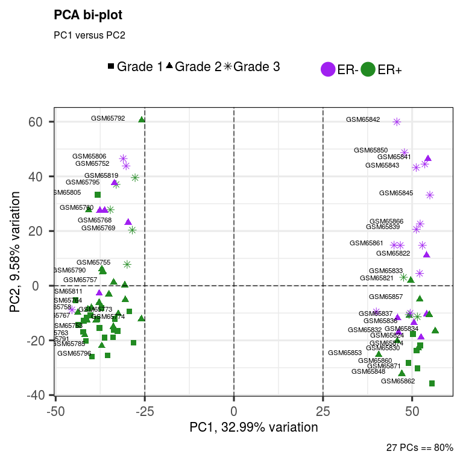

### Remove labels, modify line types, remove gridlines, and increase point size

``` r
  biplot(p,
    lab = NULL,
    colby = 'ER', colkey = c('ER+'='royalblue', 'ER-'='red3'),
    hline = 0, vline = c(-25, 0, 25),
    vlineType = c('dotdash', 'solid', 'dashed'),
    gridlines.major = FALSE, gridlines.minor = FALSE,
    pointSize = 5,
    legendPosition = 'left', legendLabSize = 16, legendIconSize = 8.0,
    shape = 'Grade', shapekey = c('Grade 1'=15, 'Grade 2'=17, 'Grade 3'=8),
    drawConnectors = FALSE,
    title = 'PCA bi-plot',
    subtitle = 'PC1 versus PC2',
    caption = '27 PCs == 80%')
```

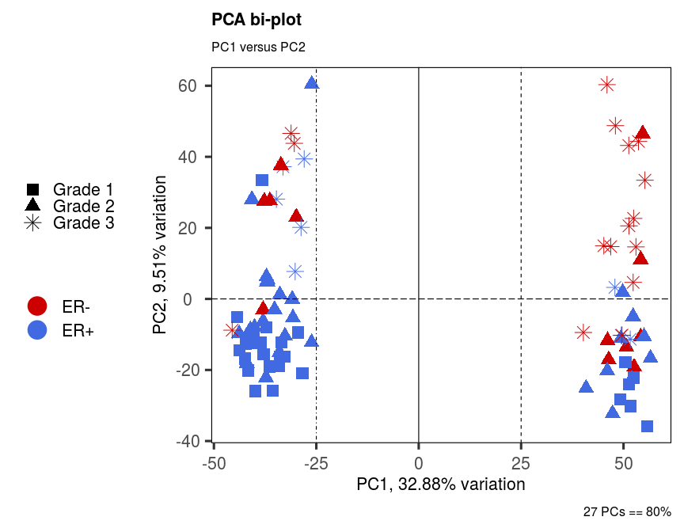

### Colour by a continuous variable (colour controlled by ggplot2 engine); plot other PCs

``` r
  biplot(p, x = 'PC10', y = 'PC50',
    lab = NULL,
    colby = 'Age',
    hline = 0, vline = 0,
    hlineWidth = 1.0, vlineWidth = 1.0,
    gridlines.major = FALSE, gridlines.minor = TRUE,
    pointSize = 5,
    legendPosition = 'left', legendLabSize = 16, legendIconSize = 8.0,
    shape = 'Grade', shapekey = c('Grade 1'=15, 'Grade 2'=17, 'Grade 3'=8),
    drawConnectors = FALSE,
    title = 'PCA bi-plot',
    subtitle = 'PC10 versus PC50',
    caption = '27 PCs == 80%')
```

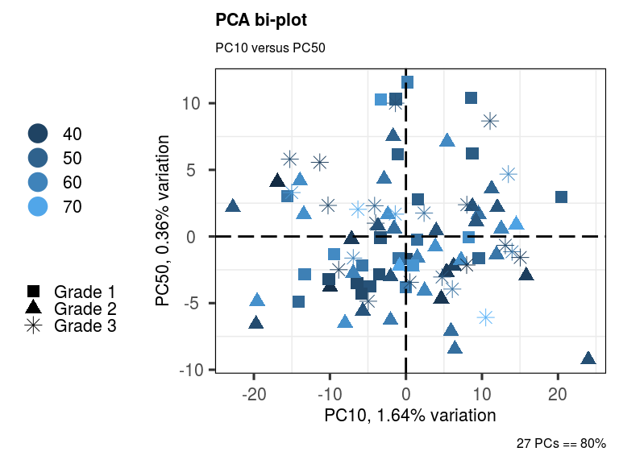

Quickly explore potentially informative PCs via a pairs plot
------------------------------------------------------------

The pairs plot in PCA unfortunately suffers from a lack of use; however, for those who love exploring data and squeezing every last ounce of information out of data, a pairs plot provides for a relatively quick way to explore useful leads for other downstream analyses.

As the number of pairwise plots increases, however, space becomes limited. We can shut off titles and axis labeling to save space. Reducing point size and colouring by a variable of interest can additionally help us to rapidly skim over the data.

``` r
  pairsplot(p,
    components = getComponents(p, c(1:10)),
    triangle = TRUE, trianglelabSize = 12,
    hline = 0, vline = 0,
    pointSize = 0.4,
    gridlines.major = FALSE, gridlines.minor = FALSE,
    colby = 'Grade',
    title = 'Pairs plot', plotaxes = FALSE,
    margingaps = unit(c(-0.01, -0.01, -0.01, -0.01), 'cm'))
```

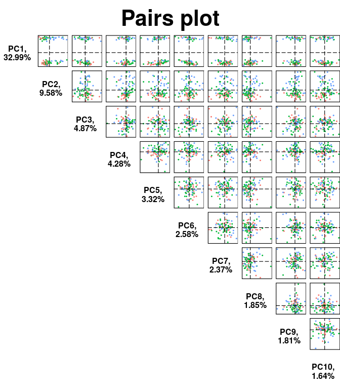

We can arrange these in a way that makes better use of the screen space by setting 'triangle = FALSE'. In this case, we can further control the layout with the 'ncol' and 'nrow' parameters, although, the function will automatically determine these based on your input data.

``` r
  pairsplot(p,
    components = getComponents(p, c(4,33,11,1)),
    triangle = FALSE,
    hline = 0, vline = 0,
    pointSize = 0.8,
    gridlines.major = FALSE, gridlines.minor = FALSE,
    colby = 'ER',
    title = 'Pairs plot', plotaxes = TRUE,
    margingaps = unit(c(0.1, 0.1, 0.1, 0.1), 'cm'))
```

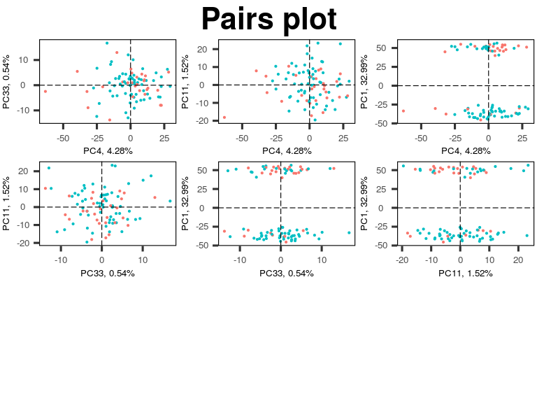

Determine the variables that drive variation among each PC
----------------------------------------------------------

If, on the bi-plot or pairs plot, we encounter evidence that 1 or more PCs are segregating a factor of interest, we can explore further the genes that are driving these differences along each PC.

For each PC of interest, 'plotloadings' determines the variables falling within the top/bottom 5% of the loadings range, and then creates a final consensus list of these. These variables are then plotted.

The loadings plot, like all others, is highly configurable. To modify the cut-off for inclusion / exclusion of variables, we use 'rangeRetain', where 0.01 equates to the top/bottom 1% of the loadings range per PC. We can also add a title, subtitle, and caption, and alter the shape and colour scheme.

``` r
  plotloadings(p,
    rangeRetain = 0.01,
    labSize = 3.0,
    title = 'Loadings plot',
    subtitle = 'PC1, PC2, PC3, PC4, PC5',
    caption = 'Top 1% variables',
    shape = 24,
    col = c('limegreen', 'black', 'red3'),
    drawConnectors = TRUE)
```

    ## -- variables retained:

    ## 215281_x_at, 214464_at, 211122_s_at, 205225_at, 202037_s_at, 204540_at, 215176_x_at, 205044_at, 208650_s_at, 205380_at

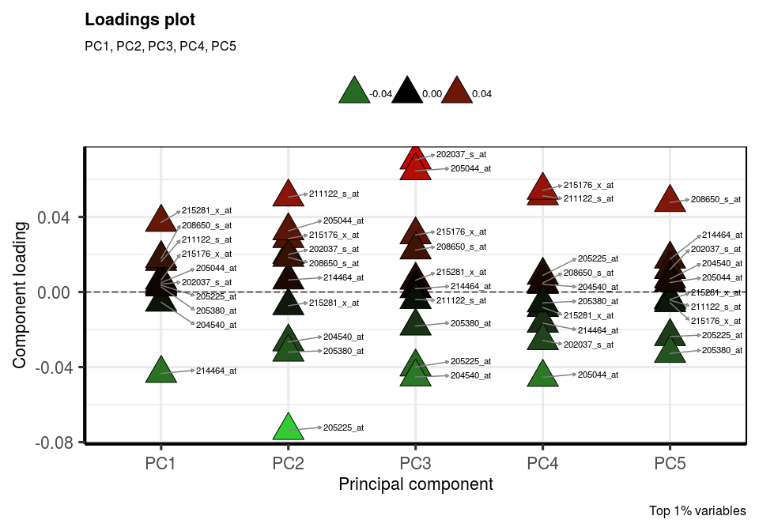

We can check the genes to which these relate by using biomaRt:

``` r
  library(biomaRt)

  mart <- useMart('ENSEMBL_MART_ENSEMBL', host = 'useast.ensembl.org')
  mart <- useDataset('hsapiens_gene_ensembl', mart)

  getBM(mart = mart,
    attributes = c('affy_hg_u133a', 'ensembl_gene_id',
      'gene_biotype', 'external_gene_name'),
    filter = 'affy_hg_u133a',
    values = c('215281_x_at', '214464_at', '211122_s_at', '205225_at',
      '202037_s_at', '204540_at', '215176_x_at', '205044_at', '208650_s_at',
      '205380_at'),
    uniqueRows = TRUE)
```

    ## Cache found

    ##    affy_hg_u133a ensembl_gene_id                       gene_biotype
    ## 1      214464_at ENSG00000143776                     protein_coding
    ## 2      205380_at ENSG00000215859 transcribed_unprocessed_pseudogene
    ## 3    208650_s_at ENSG00000272398                     protein_coding
    ## 4    211122_s_at ENSG00000169248                     protein_coding
    ## 5      204540_at ENSG00000101210                     protein_coding
    ## 6      205225_at ENSG00000091831                     protein_coding
    ## 7    215176_x_at ENSG00000242371                          IG_V_gene
    ## 8    215176_x_at ENSG00000251546                          IG_V_gene
    ## 9      205380_at ENSG00000174827                     protein_coding
    ## 10     205044_at ENSG00000094755                     protein_coding
    ## 11   215281_x_at ENSG00000143442                     protein_coding
    ## 12   208650_s_at ENSG00000185275               processed_pseudogene
    ## 13   208650_s_at ENSG00000261333               processed_pseudogene
    ## 14   202037_s_at ENSG00000104332                     protein_coding
    ## 15   215176_x_at ENSG00000282120                          IG_V_gene
    ##    external_gene_name
    ## 1            CDC42BPA
    ## 2             PDZK1P1
    ## 3                CD24
    ## 4              CXCL11
    ## 5              EEF1A2
    ## 6                ESR1
    ## 7            IGKV1-39
    ## 8           IGKV1D-39
    ## 9               PDZK1
    ## 10              GABRP
    ## 11               POGZ
    ## 12             CD24P4
    ## 13             CD24P2
    ## 14              SFRP1
    ## 15           IGKV1-39

At least one interesting finding is 205225\_at (ESR1), which is by far the gene most responsible for variation along PC2. The previous bi-plots showed that this PC also segregated ER+ from ER- patients. The other results could be explored.

With the loadings plot, in addition, we can instead plot absolute values and modify the point sizes to be proportional to the loadings. We can also switch off the line connectors and plot the loadings for any PCs

``` r
  plotloadings(p,
    components = getComponents(p, c(4,33,11,1)),
    rangeRetain = 0.1,
    labSize = 3.0,
    absolute = FALSE,
    title = 'Loadings plot',
    subtitle = 'Misc PCs',
    caption = 'Top 10% variables',
    shape = 23, shapeSizeRange = c(1, 16),
    col = c('white', 'pink'),
    drawConnectors = FALSE)
```

    ## -- variables retained:

    ## 211122_s_at, 215176_x_at, 203915_at, 210163_at, 214768_x_at, 211645_x_at, 211644_x_at, 216510_x_at, 216491_x_at, 214777_at, 216576_x_at, 212671_s_at, 211796_s_at, 204070_at, 212588_at, 212998_x_at, 209351_at, 205044_at, 209842_at, 206157_at, 219415_at, 205509_at, 204734_at, 214087_s_at, 204455_at, 203917_at, 203397_s_at, 203256_at, 218541_s_at, 214079_at, 204475_at, 205350_at, 206224_at, 209942_x_at, 205364_at, 203680_at, 213222_at, 209524_at, 206754_s_at, 205041_s_at, 205040_at, 221667_s_at, 206378_at, 212592_at, 215281_x_at, 213872_at, 203763_at, 214464_at

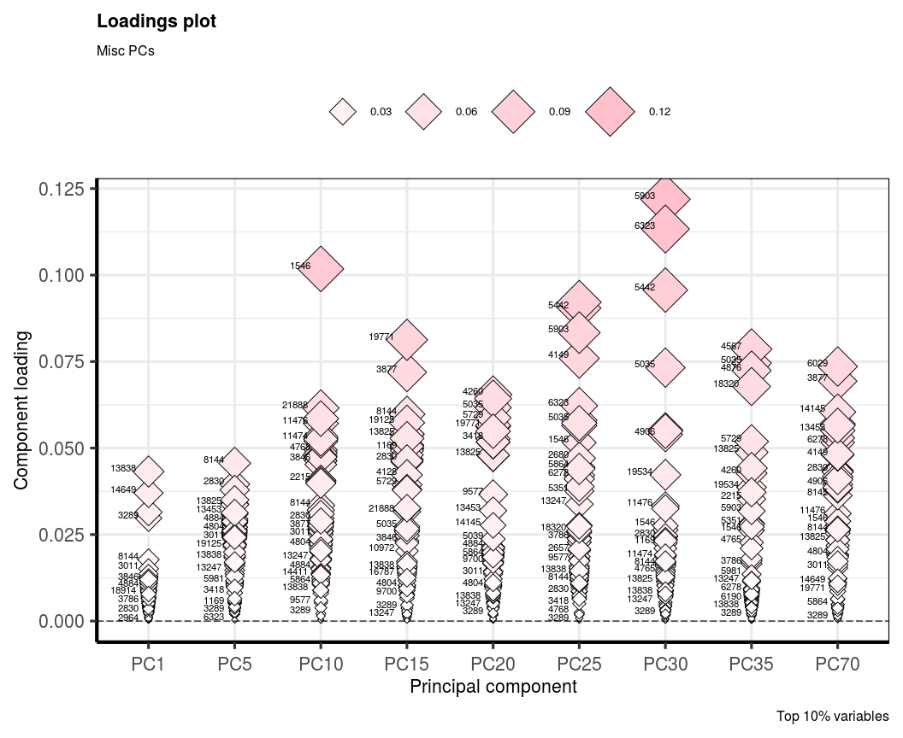

Correlate the principal components back to the clinical data
------------------------------------------------------------

Further exploration of the PCs can come through correlations with clinical data. This is also a mostly untapped resource in the era of 'big data' and can help to guide an analysis down a particular path (or not!).

We may wish, for example, to correlate all PCs that account for 80% variation in our dataset and then explore further the PCs that have statistically significant correlations.

'eigencorplot' is built upon another function by the *PCAtools* developers, namely [CorLevelPlot](https://github.com/kevinblighe/CorLevelPlot). Further examples can be found there.

``` r
  eigencorplot(p,
    components = getComponents(p, 1:27),
    metavars = c('Age','Distant.RFS','ER','GGI','Grade','Size','Time.RFS'),
    col = c('darkblue', 'blue2', 'black', 'red2', 'darkred'),
    cexCorval = 0.7,
    colCorval = 'white',
    fontCorval = 2,
    posLab = 'bottomleft',
    rotLabX = 45,
    posColKey = 'top',
    cexLabColKey = 1.5,
    scale = TRUE,
    main = 'PC1-27 clinical correlations',
    colFrame = 'white',
    plotRsquared = FALSE)
```

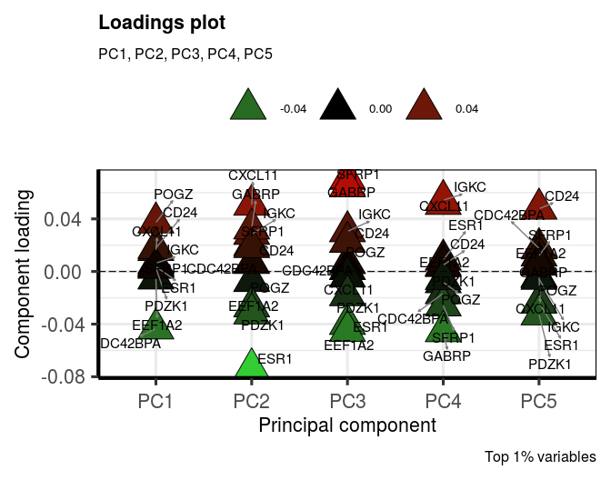

We can also supply different cut-offs for statistical significance, plot R-squared values, and specify correlation method:

``` r
  eigencorplot(p,
    components = getComponents(p, 1:horn$n),
    metavars = c('Age','Distant.RFS','ER','GGI','Grade','Size','Time.RFS'),
    col = c('white', 'cornsilk1', 'gold', 'forestgreen', 'darkgreen'),
    cexCorval = 1.2,
    fontCorval = 2,
    posLab = 'all',
    rotLabX = 45,
    scale = TRUE,
    main = bquote(Principal ~ component ~ Pearson ~ r^2 ~ clinical ~ correlates),
    plotRsquared = TRUE,
    corFUN = 'pearson',
    corUSE = 'pairwise.complete.obs',
    signifSymbols = c('****', '***', '**', '*', ''),
    signifCutpoints = c(0, 0.0001, 0.001, 0.01, 0.05, 1))
```

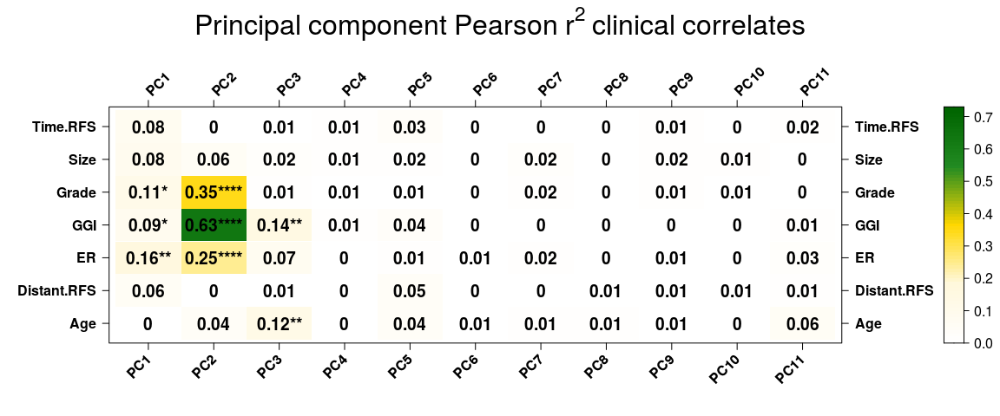

Clearly, PC2 is coming across as the most interesting PC in this experiment, with highly statistically significant correlation (p&lt;0.0001) to ER status, tumour grade, and GGI (genomic Grade Index), an indicator of response. It comes as no surprise that the gene driving most variationn along PC2 is *ESR1*, identified from our loadings plot.

This information is, of course, not new, but shows how PCA is much more than just a bi-plot used to identify outliers!

Plot the entire project on a single panel
-----------------------------------------

``` r
  pscree <- screeplot(p, components = getComponents(p, 1:30),
    hline = 80, vline = 27, axisLabSize = 10, returnPlot = FALSE) +
    geom_text(aes(20, 80, label = '80% explained variation', vjust = -1))

  ppairs <- pairsplot(p, components = getComponents(p, c(1:3)),
    triangle = TRUE, trianglelabSize = 12,
    hline = 0, vline = 0,
    pointSize = 0.8, gridlines.major = FALSE, gridlines.minor = FALSE,
    colby = 'Grade',
    title = '', titleLabSize = 16, plotaxes = FALSE,
    margingaps = unit(c(0.01, 0.01, 0.01, 0.01), 'cm'),
    returnPlot = FALSE)

  pbiplot <- biplot(p, lab = NULL,
    colby = 'ER', colkey = c('ER+'='royalblue', 'ER-'='red3'),
    hline = 0, vline = c(-25, 0, 25), vlineType = c('dotdash', 'solid', 'dashed'),
    gridlines.major = FALSE, gridlines.minor = FALSE,
    pointSize = 2, axisLabSize = 12,
    legendPosition = 'left', legendLabSize = 10, legendIconSize = 3.0,
    shape = 'Grade', shapekey = c('Grade 1'=15, 'Grade 2'=17, 'Grade 3'=8),
    drawConnectors = FALSE,
    title = 'PCA bi-plot', subtitle = 'PC1 versus PC2',
      caption = '27 PCs == 80%',
    returnPlot = FALSE)

  ploadings <- plotloadings(p, rangeRetain = 0.01, labSize = 2.5,
    title = 'Loadings plot', axisLabSize = 12,
    subtitle = 'PC1, PC2, PC3, PC4, PC5',
    caption = 'Top 1% variables',
    shape = 24, shapeSizeRange = c(4, 4),
    col = c('limegreen', 'black', 'red3'),
    legendPosition = 'none',
    drawConnectors = FALSE,
    returnPlot = FALSE)

  peigencor <- eigencorplot(p,
    components = getComponents(p, 1:10),
    metavars = c('Age','Distant.RFS','ER','GGI','Grade','Size','Time.RFS'),
    #col = c('royalblue', '', 'gold', 'forestgreen', 'darkgreen'),
    cexCorval = 0.6,
    fontCorval = 2,
    posLab = 'all', 
    rotLabX = 45,
    scale = TRUE,
    main = "PC clinical correlates",
    cexMain = 1.5,
    plotRsquared = FALSE,
    corFUN = 'pearson',
    corUSE = 'pairwise.complete.obs',
    signifSymbols = c('****', '***', '**', '*', ''),
    signifCutpoints = c(0, 0.0001, 0.001, 0.01, 0.05, 1),
    returnPlot = FALSE)

    library(cowplot)
    library(ggplotify)

    top_row <- plot_grid(pscree, ppairs, pbiplot,
      ncol = 3,
      labels = c('A', 'B  Pairs plot', 'C'),
      label_fontfamily = 'serif',
      label_fontface = 'bold',
      label_size = 22,
      align = 'h',
      rel_widths = c(1.05, 0.9, 1.05))

    bottom_row <- plot_grid(ploadings,
      as.grob(peigencor),
      ncol = 2,
      labels = c('D', 'E'),
      label_fontfamily = 'serif',
      label_fontface = 'bold',
      label_size = 22,
      align = 'h',
      rel_widths = c(1.5, 1.5))

    plot_grid(top_row, bottom_row, ncol = 1, rel_heights = c(1.0, 1.0))
```

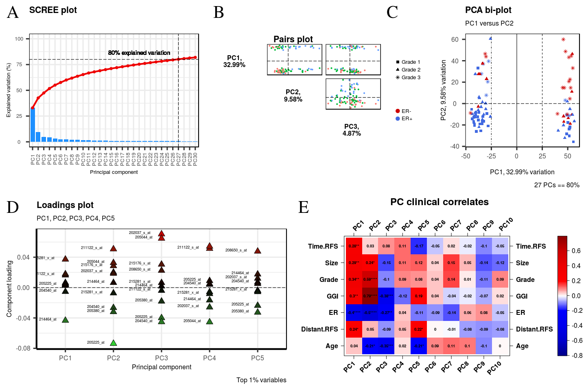

Acknowledgments
===============

The development of *PCAtools* has benefited from contributions and suggestions from:

-   Krushna Chandra Murmu
-   Jinsheng
-   Myles Lewis

Session info
============

``` r
sessionInfo()
```

    ## R version 3.6.2 (2019-12-12)
    ## Platform: x86_64-pc-linux-gnu (64-bit)
    ## Running under: Ubuntu 16.04.6 LTS
    ## 
    ## Matrix products: default
    ## BLAS:   /usr/lib/atlas-base/atlas/libblas.so.3.0
    ## LAPACK: /usr/lib/atlas-base/atlas/liblapack.so.3.0
    ## 
    ## locale:
    ##  [1] LC_CTYPE=pt_BR.UTF-8       LC_NUMERIC=C              
    ##  [3] LC_TIME=en_GB.UTF-8        LC_COLLATE=pt_BR.UTF-8    
    ##  [5] LC_MONETARY=en_GB.UTF-8    LC_MESSAGES=pt_BR.UTF-8   
    ##  [7] LC_PAPER=en_GB.UTF-8       LC_NAME=C                 
    ##  [9] LC_ADDRESS=C               LC_TELEPHONE=C            
    ## [11] LC_MEASUREMENT=en_GB.UTF-8 LC_IDENTIFICATION=C       
    ## 
    ## attached base packages:
    ## [1] parallel  stats     graphics  grDevices utils     datasets  methods  
    ## [8] base     
    ## 
    ## other attached packages:
    ##  [1] ggplotify_0.0.4     biomaRt_2.42.0      GEOquery_2.54.0    
    ##  [4] Biobase_2.46.0      BiocGenerics_0.32.0 PCAtools_1.2.0     
    ##  [7] cowplot_1.0.0       lattice_0.20-38     reshape2_1.4.3     
    ## [10] ggrepel_0.8.1       ggplot2_3.2.1      
    ## 
    ## loaded via a namespace (and not attached):
    ##  [1] httr_1.4.1               BiocSingular_1.2.0       tidyr_1.0.0             
    ##  [4] bit64_0.9-7              DelayedMatrixStats_1.8.0 assertthat_0.2.1        
    ##  [7] askpass_1.1              BiocManager_1.30.9       rvcheck_0.1.6           
    ## [10] BiocFileCache_1.10.2     highr_0.8                stats4_3.6.2            
    ## [13] dqrng_0.2.1              blob_1.2.0               yaml_2.2.0              
    ## [16] progress_1.2.2           pillar_1.4.2             RSQLite_2.1.2           
    ## [19] backports_1.1.5          glue_1.3.1               limma_3.42.0            
    ## [22] digest_0.6.22            colorspace_1.4-1         htmltools_0.4.0         
    ## [25] Matrix_1.2-17            plyr_1.8.4               XML_3.98-1.20           
    ## [28] pkgconfig_2.0.3          purrr_0.3.3              scales_1.0.0            
    ## [31] BiocParallel_1.20.0      tibble_2.1.3             openssl_1.4.1           
    ## [34] IRanges_2.20.0           ellipsis_0.3.0           withr_2.1.2             
    ## [37] lazyeval_0.2.2           magrittr_1.5             crayon_1.3.4            
    ## [40] memoise_1.1.0            evaluate_0.14            xml2_1.2.2              
    ## [43] tools_3.6.2              prettyunits_1.0.2        hms_0.5.2               
    ## [46] lifecycle_0.1.0          matrixStats_0.55.0       stringr_1.4.0           
    ## [49] S4Vectors_0.24.0         munsell_0.5.0            DelayedArray_0.12.0     
    ## [52] irlba_2.3.3              AnnotationDbi_1.48.0     compiler_3.6.2          
    ## [55] rsvd_1.0.2               gridGraphics_0.4-1       rlang_0.4.1             
    ## [58] grid_3.6.2               rappdirs_0.3.1           labeling_0.3            
    ## [61] rmarkdown_1.17           gtable_0.3.0             DBI_1.0.0               
    ## [64] curl_4.2                 R6_2.4.1                 knitr_1.26              
    ## [67] dplyr_0.8.3              bit_1.1-14               zeallot_0.1.0           
    ## [70] readr_1.3.1              stringi_1.4.3            Rcpp_1.0.3              
    ## [73] vctrs_0.2.0              dbplyr_1.4.2             tidyselect_0.2.5        
    ## [76] xfun_0.11

References
==========

Blighe and Lun (2019)

Blighe (2013)

Horn (1965)

Buja and Eyuboglu (1992)

Lun (2019)

Blighe, K. 2013. “Haplotype classification using copy number variation and principal components analysis.” The Open Bioinformatics Journal 7:19-24.

Blighe, K, and A Lun. 2019. “PCAtools: everything Principal Components Analysis.” <https://github.com/kevinblighe/PCAtools.>

Buja, A, and N Eyuboglu. 1992. “Remarks on Parallel Analysis.” Multivariate Behav. Res. 27, 509-40.

Horn, JL. 1965. “A rationale and test for the number of factors in factor analysis.” Psychometrika 30(2), 179-185.

Lun, A. 2019. “BiocSingular: Singular Value Decomposition for Bioconductor Packages.” R package version 1.0.0, https://github.com/LTLA/BiocSingular.
