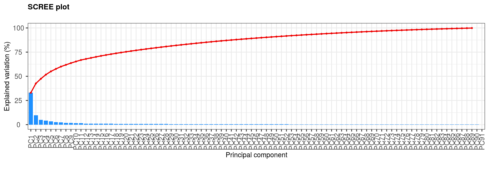
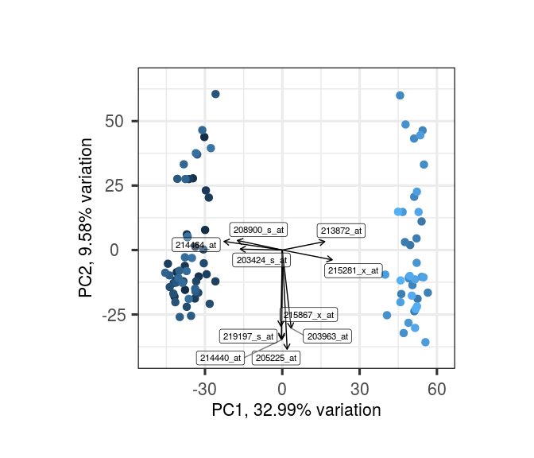
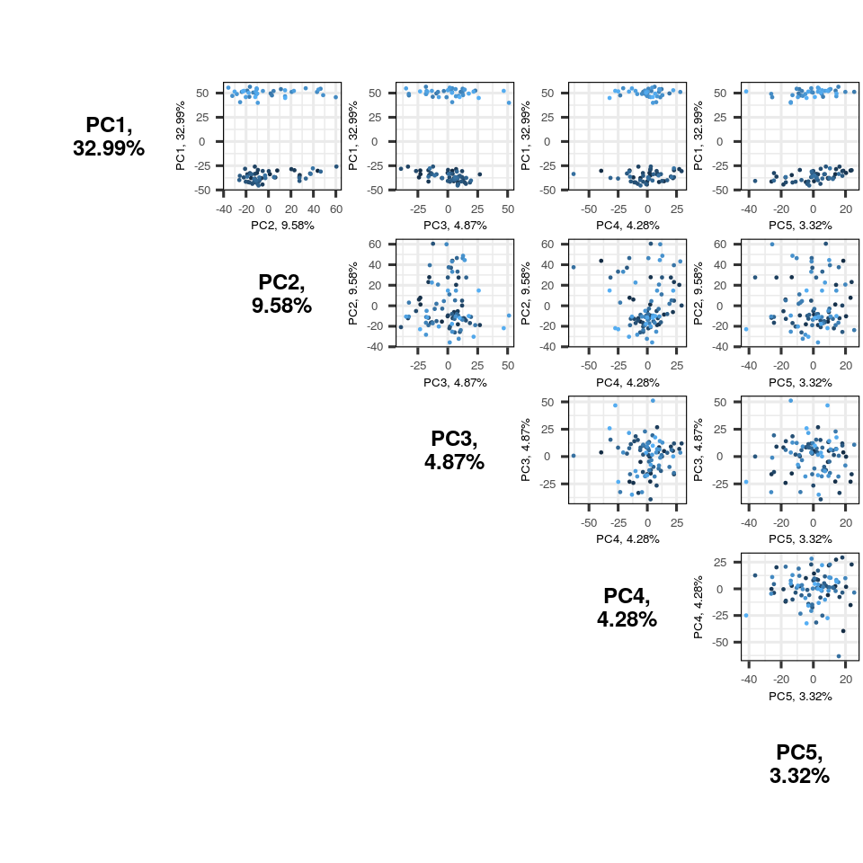
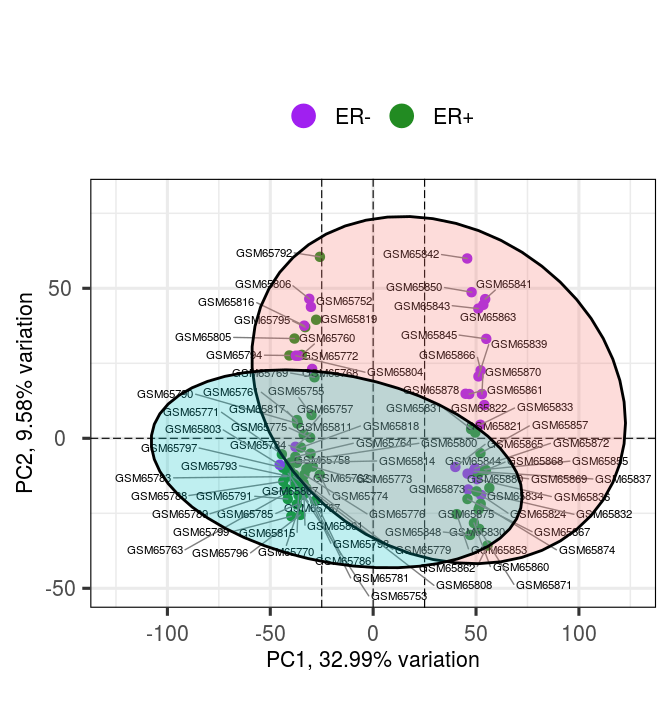

PCAtools: everything Principal Component Analysis
================
Kevin Blighe, Aaron Lun
2020-08-09

# Introduction

Principal Component Analysis (PCA) is a very powerful technique that has
wide applicability in data science, bioinformatics, and further afield.
It was initially developed to analyse large volumes of data in order to
tease out the differences/relationships between the logical entities
being analysed. It extracts the fundamental structure of the data
without the need to build any model to represent it. This ‘summary’ of
the data is arrived at through a process of reduction that can transform
the large number of variables into a lesser number that are uncorrelated
(i.e. the ‘principal components’), while at the same time being capable
of easy interpretation on the original data (Blighe and Lun 2019)
(Blighe 2013).

*PCAtools* provides functions for data exploration via PCA, and allows
the user to generate publication-ready figures. PCA is performed via
*BiocSingular* (Lun 2019) - users can also identify optimal number of
principal components via different metrics, such as elbow method and
Horn’s parallel analysis (Horn 1965) (Buja and Eyuboglu 1992), which has
relevance for data reduction in single-cell RNA-seq (scRNA-seq) and high
dimensional mass cytometry data.

# Installation

## 1\. Download the package from Bioconductor

``` r
    if (!requireNamespace('BiocManager', quietly = TRUE))
        install.packages('BiocManager')

    BiocManager::install('PCAtools')
```

Note: to install development version direct from GitHub:

``` r
    if (!requireNamespace('devtools', quietly = TRUE))
        install.packages('devtools')

    devtools::install_github('kevinblighe/PCAtools')
```

## 2\. Load the package into R session

``` r
    library(PCAtools)
```

# Quick start

For this vignette, we will load breast cancer gene expression data with
recurrence free survival (RFS) from [Gene Expression Profiling in Breast
Cancer: Understanding the Molecular Basis of Histologic Grade To Improve
Prognosis](https://www.ncbi.nlm.nih.gov/geo/query/acc.cgi?acc=GSE2990).

First, let’s read in and prepare the data:

``` r
  library(Biobase)
  library(GEOquery)

  # load series and platform data from GEO
    gset <- getGEO('GSE2990', GSEMatrix = TRUE, getGPL = FALSE)
    mat <- exprs(gset[[1]])

  # remove Affymetrix control probes
    mat <- mat[-grep('^AFFX', rownames(mat)),]

  # extract information of interest from the phenotype data (pdata)
   idx <- which(colnames(pData(gset[[1]])) %in%
      c('relation', 'age:ch1', 'distant rfs:ch1', 'er:ch1',
        'ggi:ch1', 'grade:ch1', 'size:ch1',
        'time rfs:ch1'))
    metadata <- data.frame(pData(gset[[1]])[,idx],
      row.names = rownames(pData(gset[[1]])))

  # tidy column names
    colnames(metadata) <- c('Study', 'Age', 'Distant.RFS', 'ER', 'GGI', 'Grade',
      'Size', 'Time.RFS')

  # prepare certain phenotypes of interest
    metadata$Study <- gsub('Reanalyzed by: ', '', as.character(metadata$Study))
    metadata$Age <- as.numeric(gsub('^KJ', NA, as.character(metadata$Age)))
    metadata$Distant.RFS <- factor(metadata$Distant.RFS,
      levels = c(0,1))
    metadata$ER <- factor(gsub('\\?', NA, as.character(metadata$ER)),
      levels = c(0,1))
    metadata$ER <- factor(ifelse(metadata$ER == 1, 'ER+', 'ER-'),
      levels = c('ER-', 'ER+'))
    metadata$GGI <- as.numeric(as.character(metadata$GGI))
    metadata$Grade <- factor(gsub('\\?', NA, as.character(metadata$Grade)),
      levels = c(1,2,3))
    metadata$Grade <- gsub(1, 'Grade 1', gsub(2, 'Grade 2', gsub(3, 'Grade 3', metadata$Grade)))
    metadata$Grade <- factor(metadata$Grade, levels = c('Grade 1', 'Grade 2', 'Grade 3'))
    metadata$Size <- as.numeric(as.character(metadata$Size))
    metadata$Time.RFS <- as.numeric(gsub('^KJX|^KJ', NA, metadata$Time.RFS))

  # remove samples from the pdata that have any NA value
    discard <- apply(metadata, 1, function(x) any(is.na(x)))
    metadata <- metadata[!discard,]

  # filter the expression data to match the samples in our pdata
    mat <- mat[,which(colnames(mat) %in% rownames(metadata))]

  # check that sample names match exactly between pdata and expression data 
    all(colnames(mat) == rownames(metadata))
```

    ## [1] TRUE

Conduct principal component analysis (PCA):

``` r
  p <- pca(mat, metadata = metadata, removeVar = 0.1)
```

    ## -- removing the lower 10% of variables based on variance

## A scree plot

``` r
  screeplot(p, axisLabSize = 18, titleLabSize = 22)
```



## A bi-plot

Different interpretations of the biplot exist. In the OMICs era, for
most general users, a biplot is a simple representation of samples in a
2-dimensional space, usually focusing on just the first two PCs:

``` r
  biplot(p)
```

However, the original definition of a biplot by Gabriel KR (Gabriel
1971) is a plot that plots both variables and observatinos (samples) in
the same space. The variables are indicated by arrows drawn from the
origin, which indicate their ‘weight’ in different directions. We touch
on this later via the *plotLoadings* function.

``` r
  biplot(p, showLoadings = TRUE, lab = NULL)
```



One of the probes pointing downward is *205225\_at*, which targets the
*ESR1* gene. This is already a useful validation, as the oestrogen
receptor, which is in part encoded by *ESR1*, is strongly represented by
PC2 (y-axis), with negative-to-positive receptor status going from
top-to-bottom.

More on this later in this vignette.

## A pairs plot

``` r
  pairsplot(p)
```



## A loadings plot

If the biplot was previously generated with *showLoadings = TRUE*, check
how this loadings plot corresponds to the biplot loadings - they should
match up for the top
    hits.

``` r
  plotloadings(p, labSize = 3)
```

    ## -- variables retained:

    ## 215281_x_at, 214464_at, 211122_s_at, 210163_at, 204533_at, 205225_at, 209351_at, 205044_at, 202037_s_at, 204540_at, 215176_x_at, 214768_x_at, 212671_s_at, 219415_at, 37892_at, 208650_s_at, 206754_s_at, 205358_at, 205380_at, 205825_at


## An eigencor plot

``` r
  eigencorplot(p,
    metavars = c('Study','Age','Distant.RFS','ER',
      'GGI','Grade','Size','Time.RFS'))
```


## Access the internal data

The rotated data that represents the observatinos / samples is stored in
*rotated*, while the variable loadings are stored in *loadings*

``` r
  p$rotated[1:5,1:5]
```

    ##                PC1        PC2        PC3        PC4       PC5
    ## GSM65752 -30.24272  43.826310   3.781677 -39.536149 18.612835
    ## GSM65753 -37.73436 -15.464421  -4.913100  -5.877623  9.060108
    ## GSM65755 -29.95155   7.788280 -22.980076 -15.222649 23.123766
    ## GSM65757 -33.73509   1.261410 -22.834375   2.494554 13.629207
    ## GSM65758 -40.95958  -8.588458   4.995440  14.340150  0.417101

``` r
  p$loadings[1:5,1:5]
```

    ##                     PC1         PC2          PC3        PC4           PC5
    ## 206378_at -0.0024336244 -0.05312797 -0.004809456 0.04045087  0.0096616577
    ## 205916_at -0.0051057533  0.00122765 -0.010593760 0.04023264  0.0285972617
    ## 206799_at  0.0005723191 -0.05048096 -0.009992964 0.02568142  0.0024626261
    ## 205242_at  0.0129147329  0.02867789  0.007220832 0.04424070 -0.0006138609
    ## 206509_at  0.0019058729 -0.05447596 -0.004979062 0.01510060 -0.0026213610

# Advanced features

All functions in *PCAtools* are highly configurable and should cover
virtually all basic and advanced user requirements. The following
sections take a look at some of these advanced features, and form a
somewhat practical example of how one can use *PCAtools* to make a
clinical interpretation of data.

First, let’s sort out the gene annotation by mapping the probe IDs to
gene symbols. The array used for this study was the Affymetrix U133a, so
let’s use the *hgu133a.db* Bioconductor package:

``` r
  suppressMessages(require(hgu133a.db))
  newnames <- mapIds(hgu133a.db,
    keys = rownames(p$loadings),
    column = c('SYMBOL'),
    keytype = 'PROBEID')
```

    ## 'select()' returned 1:many mapping between keys and columns

``` r
  # tidy up for NULL mappings and duplicated gene symbols
  newnames <- ifelse(is.na(newnames) | duplicated(newnames),
    names(newnames), newnames)
  rownames(p$loadings) <- newnames
```

## Determine optimum number of PCs to retain

A scree plot on its own just shows the accumulative proportion of
explained variation, but how can we determine the optimum number of PCs
to retain?

*PCAtools* provides four metrics for this purpose:

  - Elbow method
  - Horn’s parallel analysis (Horn 1965) (Buja and Eyuboglu 1992).
  - Marchenko-Pastur limit
  - Gavish-Donoho method

Let’s perform Horn’s parallel analysis first:

``` r
  horn <- parallelPCA(mat)
  horn$n
```

    ## [1] 11

Now the elbow method:

``` r
  elbow <- findElbowPoint(p$variance)
  elbow
```

    ## PC8 
    ##   8

In most cases, the identified values will disagree. This is because
finding the correct number of PCs is a difficult task and is akin to
finding the ‘correct’ number of clusters in a dataset - there is no
correct answer.

Taking these values, we can produce a new scree plot and mark these:

``` r
  library(ggplot2)

  screeplot(p,
    components = getComponents(p, 1:20),
    vline = c(horn$n, elbow)) +

    geom_label(aes(x = horn$n + 1, y = 50,
      label = 'Horn\'s', vjust = -1, size = 8)) +
    geom_label(aes(x = elbow + 1, y = 50,
      label = 'Elbow method', vjust = -1, size = 8))
```


If all else fails, one can simply take the number of PCs that
contributes to a pre-selected total of explained variation, e.g., in
this case, 27 PCs account for \>80% explained variation.

``` r
  which(cumsum(p$variance) > 80)[1]
```

    ## PC27 
    ##   27

## Modify bi-plots

The bi-plot comparing PC1 versus PC2 is the most characteristic plot of
PCA. However, PCA is much more than the bi-plot and much more than PC1
and PC2. This said, PC1 and PC2, by the very nature of PCA, are indeed
usually the most important parts of a PCA analysis.

In a bi-plot, we can shade the points by different groups and add many
more
features.

### Colour by a metadata factor, use a custom label, add lines through origin, and add legend

``` r
  biplot(p,
    lab = paste0(p$metadata$Age, ' años'),
    colby = 'ER',
    hline = 0, vline = 0,
    legendPosition = 'right')
```


### Supply custom colours and encircle variables by group

The encircle functionality literally draws a polygon around each group
specified by *colby*. It says nothing about any statistic pertaining to
each group.

``` r
  biplot(p,
    colby = 'ER', colkey = c('ER+' = 'forestgreen', 'ER-' = 'purple'),
    colLegendTitle = 'ER-\nstatus',
    # encircle config
      encircle = TRUE,
      encircleFill = TRUE,
    hline = 0, vline = c(-25, 0, 25),
    legendPosition = 'top', legendLabSize = 16, legendIconSize = 8.0)
```


``` r
  biplot(p,
    colby = 'ER', colkey = c('ER+' = 'forestgreen', 'ER-' = 'purple'),
    colLegendTitle = 'ER-\nstatus',
    # encircle config
      encircle = TRUE, encircleFill = FALSE,
      encircleAlpha = 1, encircleLineSize = 5,
    hline = 0, vline = c(-25, 0, 25),
    legendPosition = 'top', legendLabSize = 16, legendIconSize = 8.0)
```


### Stat ellipses

Stat ellipses are also drawn around each group but have a greater
statistical meaning and can be used, for example, as a strict
determination of outlier samples. Here, we draw ellipses around each
group at the 95% confidence level:

``` r
  biplot(p,
    colby = 'ER', colkey = c('ER+' = 'forestgreen', 'ER-' = 'purple'),
    # ellipse config
      ellipse = TRUE,
      ellipseConf = 0.95,
      ellipseFill = TRUE,
      ellipseAlpha = 1/4,
      ellipseLineSize = 1.0,
    xlim = c(-125,125), ylim = c(-50, 80),
    hline = 0, vline = c(-25, 0, 25),
    legendPosition = 'top', legendLabSize = 16, legendIconSize = 8.0)
```



``` r
  biplot(p,
    colby = 'ER', colkey = c('ER+' = 'forestgreen', 'ER-' = 'purple'),
    # ellipse config
      ellipse = TRUE,
      ellipseConf = 0.95,
      ellipseFill = TRUE,
      ellipseAlpha = 1/4,
      ellipseLineSize = 0,
      ellipseFillKey = c('ER+' = 'yellow', 'ER-' = 'pink'),
    xlim = c(-125,125), ylim = c(-50, 80),
    hline = 0, vline = c(-25, 0, 25),
    legendPosition = 'top', legendLabSize = 16, legendIconSize = 8.0)
```


### Change shape based on tumour grade, remove connectors, and add titles

``` r
  biplot(p,
    colby = 'ER', colkey = c('ER+' = 'forestgreen', 'ER-' = 'purple'),
    hline = c(-25, 0, 25), vline = c(-25, 0, 25),
    legendPosition = 'top', legendLabSize = 13, legendIconSize = 8.0,
    shape = 'Grade', shapekey = c('Grade 1' = 15, 'Grade 2' = 17, 'Grade 3' = 8),
    drawConnectors = FALSE,
    title = 'PCA bi-plot',
    subtitle = 'PC1 versus PC2',
    caption = '27 PCs ≈ 80%')
```

### Modify line types, remove gridlines, and increase point size

``` r
  biplot(p,
    lab = NULL,
    colby = 'ER', colkey = c('ER+'='royalblue', 'ER-'='red3'),
    hline = c(-25, 0, 25), vline = c(-25, 0, 25),
    vlineType = c('dotdash', 'solid', 'dashed'),
    gridlines.major = FALSE, gridlines.minor = FALSE,
    pointSize = 5,
    legendPosition = 'left', legendLabSize = 14, legendIconSize = 8.0,
    shape = 'Grade', shapekey = c('Grade 1'=15, 'Grade 2'=17, 'Grade 3'=8),
    drawConnectors = FALSE,
    title = 'PCA bi-plot',
    subtitle = 'PC1 versus PC2',
    caption = '27 PCs ≈ 80%')
```

Let’s plot the same as above but with loadings:

``` r
  biplot(p,
    # loadings parameters
      showLoadings = TRUE,
      lengthLoadingsArrowsFactor = 1.5,
      sizeLoadingsNames = 4,
      colLoadingsNames = 'red4',
    # other parameters
      lab = NULL,
      colby = 'ER', colkey = c('ER+'='royalblue', 'ER-'='red3'),
      hline = 0, vline = c(-25, 0, 25),
      vlineType = c('dotdash', 'solid', 'dashed'),
      gridlines.major = FALSE, gridlines.minor = FALSE,
      pointSize = 5,
      legendPosition = 'left', legendLabSize = 14, legendIconSize = 8.0,
      shape = 'Grade', shapekey = c('Grade 1'=15, 'Grade 2'=17, 'Grade 3'=8),
      drawConnectors = FALSE,
      title = 'PCA bi-plot',
      subtitle = 'PC1 versus PC2',
      caption = '27 PCs ≈ 80%')
```


### Colour by a continuous variable and plot other PCs

There are two ways to colour by a continuous variable. In the first way,
we simply ‘add on’ a continuous colour scale via
*scale\_colour\_gradient*:

``` r
  # add ESR1 gene expression to the metadata
  p$metadata$ESR1 <- mat['205225_at',]

  biplot(p,
    x = 'PC2', y = 'PC3',
    lab = NULL,
    colby = 'ESR1',
    shape = 'ER',
    hline = 0, vline = 0,
    legendPosition = 'right') +

  scale_colour_gradient(low = 'gold', high = 'red2')
```


We can also just permit that the internal *ggplot2* engine picks the
colour scheme - here, we also plot PC10 versus PC50:

``` r
  biplot(p, x = 'PC10', y = 'PC50',
    lab = NULL,
    colby = 'Age',
    hline = 0, vline = 0,
    hlineWidth = 1.0, vlineWidth = 1.0,
    gridlines.major = FALSE, gridlines.minor = TRUE,
    pointSize = 5,
    legendPosition = 'left', legendLabSize = 16, legendIconSize = 8.0,
    shape = 'Grade', shapekey = c('Grade 1'=15, 'Grade 2'=17, 'Grade 3'=8),
    drawConnectors = FALSE,
    title = 'PCA bi-plot',
    subtitle = 'PC10 versus PC50',
    caption = '27 PCs ≈ 80%')
```

## Quickly explore potentially informative PCs via a pairs plot

The pairs plot in PCA unfortunately suffers from a lack of use; however,
for those who love exploring data and squeezing every last ounce of
information out of data, a pairs plot provides for a relatively quick
way to explore useful leads for other downstream analyses.

As the number of pairwise plots increases, however, space becomes
limited. We can shut off titles and axis labeling to save space.
Reducing point size and colouring by a variable of interest can
additionally help us to rapidly skim over the data.

``` r
  pairsplot(p,
    components = getComponents(p, c(1:10)),
    triangle = TRUE, trianglelabSize = 12,
    hline = 0, vline = 0,
    pointSize = 0.4,
    gridlines.major = FALSE, gridlines.minor = FALSE,
    colby = 'Grade',
    title = 'Pairs plot', plotaxes = FALSE,
    margingaps = unit(c(-0.01, -0.01, -0.01, -0.01), 'cm'))
```


We can arrange these in a way that makes better use of the screen space
by setting ‘triangle = FALSE’. In this case, we can further control the
layout with the ‘ncol’ and ‘nrow’ parameters, although, the function
will automatically determine these based on your input data.

``` r
  pairsplot(p,
    components = getComponents(p, c(4,33,11,1)),
    triangle = FALSE,
    hline = 0, vline = 0,
    pointSize = 0.8,
    gridlines.major = FALSE, gridlines.minor = FALSE,
    colby = 'ER',
    title = 'Pairs plot', titleLabSize = 22,
    axisLabSize = 14, plotaxes = TRUE,
    margingaps = unit(c(0.1, 0.1, 0.1, 0.1), 'cm'))
```


## Determine the variables that drive variation among each PC

If, on the bi-plot or pairs plot, we encounter evidence that 1 or more
PCs are segregating a factor of interest, we can explore further the
genes that are driving these differences along each PC.

For each PC of interest, ‘plotloadings’ determines the variables falling
within the top/bottom 5% of the loadings range, and then creates a final
consensus list of these. These variables are then plotted.

The loadings plot, like all others, is highly configurable. To modify
the cut-off for inclusion / exclusion of variables, we use
*rangeRetain*, where 0.01 equates to the top/bottom 1% of the loadings
range per PC.

``` r
  plotloadings(p,
    rangeRetain = 0.01,
    labSize = 4.0,
    title = 'Loadings plot',
    subtitle = 'PC1, PC2, PC3, PC4, PC5',
    caption = 'Top 1% variables',
    shape = 24,
    col = c('limegreen', 'black', 'red3'),
    drawConnectors = TRUE)
```

    ## -- variables retained:

    ## POGZ, CDC42BPA, CXCL11, ESR1, SFRP1, EEF1A2, IGKC, GABRP, CD24, PDZK1


At least one interesting finding is *205225\_at* / *ESR1*, which is by
far the gene most responsible for variation along PC2. The previous
bi-plots showed that this PC also segregated ER+ from ER- patients. The
other results could be explored. Also, from the biplots with loadings
that we have already generated, this result is also verified in these.

With the loadings plot, in addition, we can instead plot absolute values
and modify the point sizes to be proportional to the loadings. We can
also switch off the line connectors and plot the loadings for any PCs

``` r
  plotloadings(p,
    components = getComponents(p, c(4,33,11,1)),
    rangeRetain = 0.1,
    labSize = 4.0,
    absolute = FALSE,
    title = 'Loadings plot',
    subtitle = 'Misc PCs',
    caption = 'Top 10% variables',
    shape = 23, shapeSizeRange = c(1, 16),
    col = c('white', 'pink'),
    drawConnectors = FALSE)
```

    ## -- variables retained:

    ## CXCL11, IGKC, CXCL9, 210163_at, 214768_x_at, 211645_x_at, 211644_x_at, IGHA1, 216491_x_at, 214777_at, 216576_x_at, 212671_s_at, IL23A, PLAAT4, 212588_at, 212998_x_at, KRT14, GABRP, SOX10, PTX3, TTYH1, CPB1, KRT15, MYBPC1, DST, CXADR, GALNT3, CDH3, TCIM, DHRS2, MMP1, CRABP1, CST1, MAGEA3, ACOX2, PRKAR2B, PLCB1, HDGFL3, CYP2B6, ORM1, 205040_at, HSPB8, SCGB2A2, JCHAIN, POGZ, 213872_at, DYNC2LI1, CDC42BPA


## Correlate the principal components back to the clinical data

Further exploration of the PCs can come through correlations with
clinical data. This is also a mostly untapped resource in the era of
‘big data’ and can help to guide an analysis down a particular path.

We may wish, for example, to correlate all PCs that account for 80%
variation in our dataset and then explore further the PCs that have
statistically significant correlations.

‘eigencorplot’ is built upon another function by the *PCAtools*
developers, namely
[CorLevelPlot](https://github.com/kevinblighe/CorLevelPlot). Further
examples can be found there.

``` r
  eigencorplot(p,
    components = getComponents(p, 1:27),
    metavars = c('Study','Age','Distant.RFS','ER',
      'GGI','Grade','Size','Time.RFS'),
    col = c('darkblue', 'blue2', 'black', 'red2', 'darkred'),
    cexCorval = 0.7,
    colCorval = 'white',
    fontCorval = 2,
    posLab = 'bottomleft',
    rotLabX = 45,
    posColKey = 'top',
    cexLabColKey = 1.5,
    scale = TRUE,
    main = 'PC1-27 clinical correlations',
    colFrame = 'white',
    plotRsquared = FALSE)
```


We can also supply different cut-offs for statistical significance,
apply p-value adjustment, plot R-squared values, and specify correlation
method:

``` r
  eigencorplot(p,
    components = getComponents(p, 1:horn$n),
    metavars = c('Study','Age','Distant.RFS','ER','GGI',
      'Grade','Size','Time.RFS'),
    col = c('white', 'cornsilk1', 'gold', 'forestgreen', 'darkgreen'),
    cexCorval = 1.2,
    fontCorval = 2,
    posLab = 'all',
    rotLabX = 45,
    scale = TRUE,
    main = bquote(Principal ~ component ~ Pearson ~ r^2 ~ clinical ~ correlates),
    plotRsquared = TRUE,
    corFUN = 'pearson',
    corUSE = 'pairwise.complete.obs',
    corMultipleTestCorrection = 'BH',
    signifSymbols = c('****', '***', '**', '*', ''),
    signifCutpoints = c(0, 0.0001, 0.001, 0.01, 0.05, 1))
```


Clearly, PC2 is coming across as the most interesting PC in this
experiment, with highly statistically significant correlation
(p\<0.0001) to ER status, tumour grade, and GGI (genomic Grade Index),
an indicator of response. It comes as no surprise that the gene driving
most variationn along PC2 is *ESR1*, identified from our loadings plot.

This information is, of course, not new, but shows how PCA is much more
than just a bi-plot used to identify outliers\!

## Plot the entire project on a single panel

``` r
  pscree <- screeplot(p, components = getComponents(p, 1:30),
    hline = 80, vline = 27, axisLabSize = 14, titleLabSize = 20,
    returnPlot = FALSE) +
    geom_label(aes(20, 80, label = '80% explained variation', vjust = -1, size = 8))

  ppairs <- pairsplot(p, components = getComponents(p, c(1:3)),
    triangle = TRUE, trianglelabSize = 12,
    hline = 0, vline = 0,
    pointSize = 0.8, gridlines.major = FALSE, gridlines.minor = FALSE,
    colby = 'Grade',
    title = '', plotaxes = FALSE,
    margingaps = unit(c(0.01, 0.01, 0.01, 0.01), 'cm'),
    returnPlot = FALSE)

  pbiplot <- biplot(p,
    # loadings parameters
      showLoadings = TRUE,
      lengthLoadingsArrowsFactor = 1.5,
      sizeLoadingsNames = 4,
      colLoadingsNames = 'red4',
    # other parameters
      lab = NULL,
      colby = 'ER', colkey = c('ER+'='royalblue', 'ER-'='red3'),
      hline = 0, vline = c(-25, 0, 25),
      vlineType = c('dotdash', 'solid', 'dashed'),
      gridlines.major = FALSE, gridlines.minor = FALSE,
      pointSize = 5,
      legendPosition = 'none', legendLabSize = 16, legendIconSize = 8.0,
      shape = 'Grade', shapekey = c('Grade 1'=15, 'Grade 2'=17, 'Grade 3'=8),
      drawConnectors = FALSE,
      title = 'PCA bi-plot',
      subtitle = 'PC1 versus PC2',
      caption = '27 PCs ≈ 80%',
      returnPlot = FALSE)

  ploadings <- plotloadings(p, rangeRetain = 0.01, labSize = 4,
    title = 'Loadings plot', axisLabSize = 12,
    subtitle = 'PC1, PC2, PC3, PC4, PC5',
    caption = 'Top 1% variables',
    shape = 24, shapeSizeRange = c(4, 8),
    col = c('limegreen', 'black', 'red3'),
    legendPosition = 'none',
    drawConnectors = FALSE,
    returnPlot = FALSE)

  peigencor <- eigencorplot(p,
    components = getComponents(p, 1:10),
    metavars = c('Study','Age','Distant.RFS','ER',
      'GGI','Grade','Size','Time.RFS'),
    cexCorval = 1.0,
    fontCorval = 2,
    posLab = 'all', 
    rotLabX = 45,
    scale = TRUE,
    main = "PC clinical correlates",
    cexMain = 1.5,
    plotRsquared = FALSE,
    corFUN = 'pearson',
    corUSE = 'pairwise.complete.obs',
    signifSymbols = c('****', '***', '**', '*', ''),
    signifCutpoints = c(0, 0.0001, 0.001, 0.01, 0.05, 1),
    returnPlot = FALSE)

    library(cowplot)
    library(ggplotify)

    top_row <- plot_grid(pscree, ppairs, pbiplot,
      ncol = 3,
      labels = c('A', 'B  Pairs plot', 'C'),
      label_fontfamily = 'serif',
      label_fontface = 'bold',
      label_size = 22,
      align = 'h',
      rel_widths = c(1.10, 0.80, 1.10))

    bottom_row <- plot_grid(ploadings,
      as.grob(peigencor),
      ncol = 2,
      labels = c('D', 'E'),
      label_fontfamily = 'serif',
      label_fontface = 'bold',
      label_size = 22,
      align = 'h',
      rel_widths = c(0.8, 1.2))

    plot_grid(top_row, bottom_row, ncol = 1,
      rel_heights = c(1.1, 0.9))
```


## Make predictions on new data

It is possible to use the variable loadings as part of a matrix
calculation to ‘predict’ principal component eigenvectors in new data.
This is elaborated in a posting by Pandula Priyadarshana: [How to use
Principal Component Analysis (PCA) to make
Predictions](https://rpubs.com/PandulaP/PCA_for_Predictions).

The *pca* class, which is created by *PCAtools*, is not configured to
work with *stats::predict*; however, trusty *prcomp* class **is**
configured. We can manually create a *prcomp* object and then use that
in model prediction, as elaborated in the following code chunk:

``` r
  p <- pca(mat, metadata = metadata, removeVar = 0.1)
```

    ## -- removing the lower 10% of variables based on variance

``` r
  p.prcomp <- list(sdev = p$sdev,
    rotation = data.matrix(p$loadings),
    x = data.matrix(p$rotated),
    center = TRUE, scale = TRUE)

  class(p.prcomp) <- 'prcomp'

  # for this simple example, just use a chunk of
  # the original data for the prediction
  newdata <- t(mat[,seq(1,20)])
  predict(p.prcomp, newdata = newdata)[,1:5]
```

    ##                 PC1         PC2        PC3          PC4         PC5
    ## GSM65752  11.683293  71.0152986  10.677205 -75.97644152  29.7537169
    ## GSM65753 -10.542633 -31.9953531  -2.753783 -19.59178967  14.9924713
    ## GSM65755   6.585509  13.4975310 -40.370389 -29.38990525  47.7142845
    ## GSM65757   1.498398  -0.1294115 -37.336278   0.08078156  22.3448232
    ## GSM65758 -18.049833 -14.9445805  14.890320  16.57567005   3.4010033
    ## GSM65760   8.073473  47.5491189 -18.016340  -9.73629569 -51.7330414
    ## GSM65761  -3.689814   7.7199606 -35.476666 -35.31465087 -40.1455143
    ## GSM65762   3.949911 -24.9428080   4.710631   2.71721065  43.2182093
    ## GSM65763 -20.757238 -33.3085383  22.639443   7.41053224  -9.9339918
    ## GSM65764 -12.287305 -12.7566718  13.813429  33.75583684  17.7938583
    ## GSM65767  -4.209505 -13.9349129 -17.814569 -14.87200276 -82.4754172
    ## GSM65768   3.547044  39.6095431 -28.424912  40.26444836  45.6591355
    ## GSM65769   3.754370  30.0201461  12.415498  45.74502641  37.9905308
    ## GSM65770   2.538593 -36.6517740  54.887990   5.94021104  -0.9545218
    ## GSM65771  -7.382089  -8.5963702  27.749060 -21.50981794 -71.4524526
    ## GSM65772   3.735223  43.2576570  26.995375  21.01817312 -68.8193200
    ## GSM65773  15.775812 -19.4523339   4.419158  -6.47899302 -25.2479186
    ## GSM65774  17.589719 -28.5666333 -52.875007 -16.82207768  37.8455365
    ## GSM65775  -3.375783  -5.2950960  27.071957  49.10111537  55.0410908
    ## GSM65776   1.562855 -22.0947718  12.797877   7.08296875  -4.9924828

# Acknowledgments

The development of *PCAtools* has benefited from contributions and
suggestions from:

  - Krushna Chandra Murmu
  - Jinsheng
  - Myles Lewis
  - Anna-Leigh Brown
  - Vincent Carey
  - Vince Vu
  - Guido Hooiveld
  - pwwang
  - Pandula Priyadarshana
  - Barley Rose Collier Harris

# Session info

``` r
sessionInfo()
```

    ## R version 4.0.2 (2020-06-22)
    ## Platform: x86_64-pc-linux-gnu (64-bit)
    ## Running under: Ubuntu 16.04.6 LTS
    ## 
    ## Matrix products: default
    ## BLAS:   /usr/lib/atlas-base/atlas/libblas.so.3.0
    ## LAPACK: /usr/lib/atlas-base/atlas/liblapack.so.3.0
    ## 
    ## locale:
    ##  [1] LC_CTYPE=pt_BR.UTF-8       LC_NUMERIC=C              
    ##  [3] LC_TIME=en_GB.UTF-8        LC_COLLATE=pt_BR.UTF-8    
    ##  [5] LC_MONETARY=en_GB.UTF-8    LC_MESSAGES=pt_BR.UTF-8   
    ##  [7] LC_PAPER=en_GB.UTF-8       LC_NAME=C                 
    ##  [9] LC_ADDRESS=C               LC_TELEPHONE=C            
    ## [11] LC_MEASUREMENT=en_GB.UTF-8 LC_IDENTIFICATION=C       
    ## 
    ## attached base packages:
    ## [1] stats4    parallel  stats     graphics  grDevices utils     datasets 
    ## [8] methods   base     
    ## 
    ## other attached packages:
    ##  [1] ggplotify_0.0.5      cowplot_1.0.0        hgu133a.db_3.2.3    
    ##  [4] org.Hs.eg.db_3.11.4  AnnotationDbi_1.50.0 IRanges_2.22.2      
    ##  [7] S4Vectors_0.26.1     GEOquery_2.56.0      Biobase_2.48.0      
    ## [10] BiocGenerics_0.34.0  PCAtools_2.1.22      ggrepel_0.8.2       
    ## [13] ggplot2_3.3.2       
    ## 
    ## loaded via a namespace (and not attached):
    ##  [1] maps_3.3.0                BiocSingular_1.4.0       
    ##  [3] tidyr_1.1.0               bit64_0.9-7              
    ##  [5] DelayedMatrixStats_1.10.0 BiocManager_1.30.10      
    ##  [7] rvcheck_0.1.8             highr_0.8                
    ##  [9] dqrng_0.2.1               blob_1.2.1               
    ## [11] yaml_2.2.1                Rttf2pt1_1.3.8           
    ## [13] pillar_1.4.4              RSQLite_2.2.0            
    ## [15] lattice_0.20-41           glue_1.4.1               
    ## [17] limma_3.44.3              extrafontdb_1.0          
    ## [19] digest_0.6.25             RColorBrewer_1.1-2       
    ## [21] colorspace_1.4-1          htmltools_0.5.0          
    ## [23] Matrix_1.2-18             plyr_1.8.6               
    ## [25] pkgconfig_2.0.3           purrr_0.3.4              
    ## [27] scales_1.1.1              BiocParallel_1.22.0      
    ## [29] tibble_3.0.1              generics_0.0.2           
    ## [31] farver_2.0.3              ellipsis_0.3.1           
    ## [33] withr_2.2.0               magrittr_1.5             
    ## [35] crayon_1.3.4              memoise_1.1.0            
    ## [37] evaluate_0.14             ash_1.0-15               
    ## [39] MASS_7.3-51.6             xml2_1.3.2               
    ## [41] tools_4.0.2               hms_0.5.3                
    ## [43] lifecycle_0.2.0           matrixStats_0.56.0       
    ## [45] stringr_1.4.0             munsell_0.5.0            
    ## [47] DelayedArray_0.14.0       irlba_2.3.3              
    ## [49] compiler_4.0.2            ggalt_0.4.0              
    ## [51] rsvd_1.0.3                gridGraphics_0.5-0       
    ## [53] rlang_0.4.6               grid_4.0.2               
    ## [55] labeling_0.3              rmarkdown_2.3            
    ## [57] proj4_1.0-10              gtable_0.3.0             
    ## [59] DBI_1.1.0                 curl_4.3                 
    ## [61] reshape2_1.4.4            R6_2.4.1                 
    ## [63] knitr_1.29                dplyr_1.0.0              
    ## [65] bit_1.1-15.2              extrafont_0.17           
    ## [67] KernSmooth_2.23-17        readr_1.3.1              
    ## [69] stringi_1.4.6             Rcpp_1.0.4.6             
    ## [71] vctrs_0.3.1               tidyselect_1.1.0         
    ## [73] xfun_0.15

# References

Blighe and Lun (2019)

Blighe (2013)

Horn (1965)

Buja and Eyuboglu (1992)

Lun (2019)

Gabriel (1971)

<div id="refs" class="references">

<div id="ref-BligheK">

Blighe, K. 2013. “Haplotype classification using copy number variation
and principal components analysis.” The Open Bioinformatics Journal
7:19-24.

</div>

<div id="ref-PCAtools">

Blighe, K, and A Lun. 2019. “PCAtools: everything Principal Components
Analysis.” <https://github.com/kevinblighe/PCAtools.>

</div>

<div id="ref-Buja">

Buja, A, and N Eyuboglu. 1992. “Remarks on Parallel Analysis.”
Multivariate Behav. Res. 27, 509-40.

</div>

<div id="ref-Gabriel">

Gabriel, KR. 1971. “The Biplot Graphic Display of Matrices with
Application to Principal Component Analysis 1.” *Biometrika* 58 (3):
453–67. <http://biomet.oxfordjournals.org/content/58/3/453.short>.

</div>

<div id="ref-Horn">

Horn, JL. 1965. “A rationale and test for the number of factors in
factor analysis.” Psychometrika 30(2), 179-185.

</div>

<div id="ref-Lun">

Lun, A. 2019. “BiocSingular: Singular Value Decomposition for
Bioconductor Packages.” R package version 1.0.0,
https://github.com/LTLA/BiocSingular.

</div>

</div>
